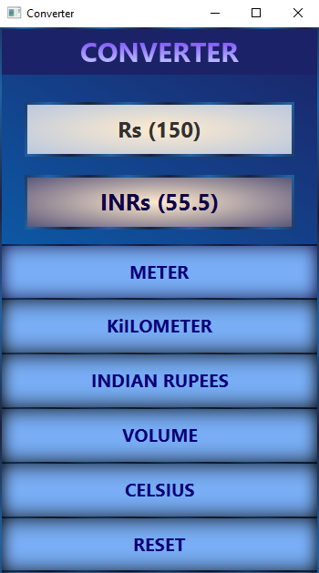

# RAD Converter

This is a mini cconverter using JavaFx. Client able to convert measurements to some specific units. There are five different kind of convert options available.
- Kilometeres(km) -> Meters(m)
- Meters(m) -> Kilometeres(km)
- Rupees(Rs) -> IndianRupees(INRs)
- Calculate volume of cube
- Fahrenheit(°F) -> Celsius(°C)

## Screen Shots

    
    
    
    

